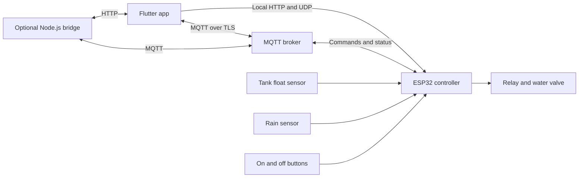

# Verdant Guardian

### My Water System

Verdant Guardian is a safety-first smart plant-watering system built with an ESP32 controller and a Flutter companion app. I made it so my elderly parents would not have to remember, carry water, or worry about the plants when I am away.

The system keeps essential watering controls local, continues to follow saved schedules without the internet, and adds remote monitoring through MQTT when cloud connectivity is available.

## What it does

- Starts and stops watering from physical buttons, the Flutter app, a local web page, MQTT, or optional Telegram commands.
- Stores four weekly watering schedules on the ESP32.
- Discovers controllers automatically on the local network with UDP.
- Reports valve state, remaining watering time, tank level, rain state, Wi-Fi signal, uptime, and safety status.
- Stops watering when the tank is empty, rain is detected, the maximum run time is reached, or the emergency stop is activated.
- Delays future watering after rain and can optionally check a weather forecast.
- Restores an interrupted watering session safely after a power loss.
- Supports local HTTP control, MQTT control, mDNS, and over-the-air firmware updates.

## System design



The ESP32 is the source of truth for valve state and safety decisions. Cloud services improve remote access but are not required for schedules, physical controls, tank protection, rain protection, or the local web interface.

## Repository layout

| Path | Purpose |
| --- | --- |
| `lib/` | Flutter app and device-control interface |
| `assets/` | App icon and public MQTT CA certificate |
| `shaders/` | Water and ripple visual effects |
| `firmware/verdant_controller/` | ESP32 firmware and configuration template |
| `watering-server/` | Optional Node.js HTTP and MQTT bridge |
| `test/` | Flutter widget tests |

## Hardware

The firmware targets an ESP32 development board with an active-low relay.

| Function | ESP32 pin |
| --- | ---: |
| Relay or valve | GPIO 25 |
| Built-in status LED | GPIO 2 |
| RGB LED red | GPIO 14 |
| RGB LED green | GPIO 27 |
| RGB LED blue | GPIO 33 |
| Manual on button | GPIO 5 |
| Manual off or emergency button | GPIO 26 |
| Tank float sensor | GPIO 32 |
| Rain sensor | GPIO 4 |

Use a correctly rated relay or MOSFET driver, a flyback diode for inductive loads, a separate valve or pump power supply, a common ground where appropriate, and waterproof enclosures. Never power a pump directly from an ESP32 pin.

## Flutter app setup

Requirements:

- Flutter with Dart 3.11 or newer
- Android Studio or another supported Flutter target toolchain

Install dependencies and run the app in local-network mode:

```bash
flutter pub get
flutter run
```

To enable remote MQTT access, pass credentials at build time instead of storing them in source control:

```bash
flutter run \
  --dart-define=VERDANT_MQTT_BROKER=broker.example.com \
  --dart-define=VERDANT_MQTT_PORT=8883 \
  --dart-define=VERDANT_MQTT_USERNAME=your-username \
  --dart-define=VERDANT_MQTT_PASSWORD=your-password \
  --dart-define=VERDANT_DEVICE_ID=ESP32_1
```

Android permits clear-text traffic because the app talks directly to the ESP32 over trusted local Wi-Fi. Do not expose the ESP32 HTTP server to the public internet.

## ESP32 firmware setup

Open `firmware/verdant_controller/verdant_controller.ino` in Arduino IDE. Copy `config.example.h` to `config.h`, fill in the settings you use, select **ESP32 Dev Module**, and upload.

Required Arduino libraries:

- ArduinoJson
- PubSubClient
- UniversalTelegramBot

Wi-Fi, MQTT, weather, Telegram, OTA, and bridge credentials belong only in `config.h`. That file is ignored by Git. MQTT, weather, Telegram, and the bridge are optional; local controls and saved schedules remain available without them.

See [`firmware/README.md`](firmware/README.md) for the upload and wiring checklist.

## Optional bridge

The Node.js service forwards HTTP commands to a registered controller and can relay commands and status through MQTT.

```bash
cd watering-server
npm ci
npm start
```

Copy `.env.example` to `.env` and provide only the values you need. See [`watering-server/README.md`](watering-server/README.md) for endpoints and deployment notes.

## Communication reference

| Topic | Direction | Payload |
| --- | --- | --- |
| `water/<device-id>/control` | App or bridge to ESP32 | `{"cmd":"ON","duration":600}` |
| `water/<device-id>/schedule` | App or bridge to ESP32 | Schedule JSON |
| `water/<device-id>/status` | ESP32 to app or bridge | Valve state and remaining time |
| `water/<device-id>/online` | ESP32 to broker | Retained online state |

The ESP32 local HTTP API exposes `/status`, `/on`, `/off`, `/schedule`, `/getschedules`, `/setwifi`, and a small control page at `/`. UDP discovery uses port `4210` and the request `WATER_DISCOVERY_REQUEST`.

## Safety and privacy

- Test the relay with the water supply disconnected before the first live run.
- Confirm the relay active-low behavior before connecting a valve or pump.
- Treat tank and rain sensors as safeguards, not certified fail-safe devices.
- Keep local HTTP endpoints on a trusted LAN because they do not provide user authentication.
- Never commit `config.h`, `.env`, broker passwords, bot tokens, API keys, or home Wi-Fi credentials.
- Rotate any credential that has previously been shared or stored in an unsafe place.

This is a personal home-automation project, not a certified irrigation or life-safety system. Supervise initial runs and add a physical shutoff valve that family members can reach easily.

## Why Verdant Guardian

The project is less about making plants smart and more about removing a repetitive physical task from my parents' day. It quietly watches the water level, rain, schedules, and valve so the garden can be cared for even when I cannot be there.
